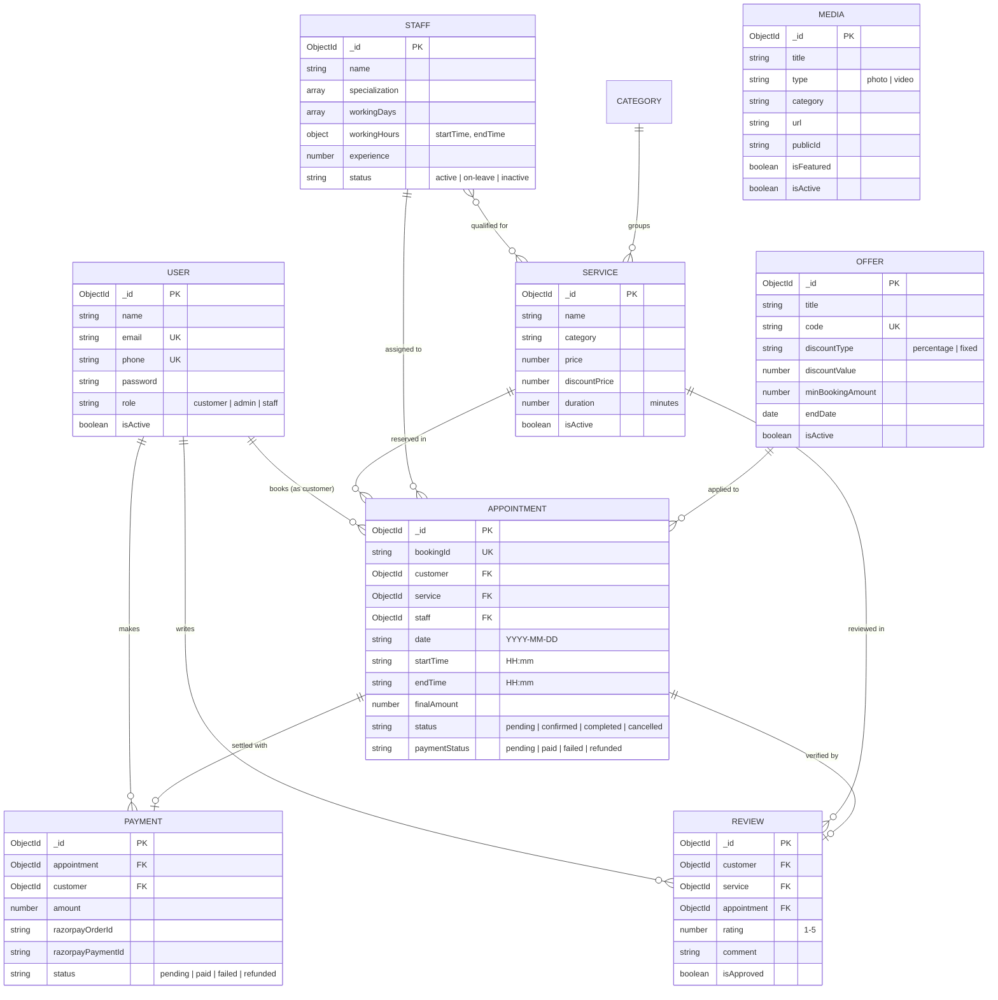

# LuxeParlour — Premium Salon & Spa Booking Platform

A full-stack, production-grade salon management and appointment reservation platform for **LuxeParlour Salon & Spa**, located at **450 Fashion Avenue, Suite 1800, New York, NY 10018**.

Built with the **MERN Stack** (MongoDB, Express, React, Node.js), Tailwind CSS v4, Lucide Icons, Razorpay Payment Gateway, Cloudinary Media Storage, and Nodemailer Transactional Notifications.

---

## Table of Contents

1. [Project Overview](#project-overview)
2. [Key Features & Implemented Phases (1–13)](#key-features--implemented-phases-113)
3. [Design Principles & Authentic Salon Rules](#design-principles--authentic-salon-rules)
4. [Technology Stack](#technology-stack)
5. [Project Architecture & File Tree](#project-architecture--file-tree)
6. [Database Models & Relationships](#database-models--relationships)
7. [API Endpoints Reference](#api-endpoints-reference)
8. [Step-by-Step Setup & Installation Guide](#step-by-step-setup--installation-guide)
9. [Environment Variables Reference](#environment-variables-reference)
10. [Security & Production Readiness](#security--production-readiness)
11. [Testing & Verification](#testing--verification)

---

## Project Overview

LuxeParlour is designed to operate as a genuine, high-end beauty boutique and medical spa website. Unlike generic CRUD applications, the platform features:
- **Real-Time Booking Engine**: Calculates available time slots dynamically based on stylist working days, salon operating hours, treatment duration, and existing appointments.
- **Concurrency & Race Condition Protection**: Database-level partial unique compound indexes guarantee that no two clients can book the same stylist at the same time.
- **Dual Payment Flows**: Complete Razorpay online checkout with server-side HMAC-SHA256 signature verification, plus in-person payment tracking at reception.
- **Interactive Media Portfolio**: Categorized photo galleries, responsive video walkthroughs, and an interactive Before & After transformation comparison slider.
- **Verified Review Ecosystem**: Only clients with completed appointments can submit ratings and reviews, which are moderated via the Admin Console.
- **Promotional Offers & Bundles Engine**: Promo code validation, percentage/dollar discount calculations, minimum booking constraints, and one-click code application.
- **Automated Transactional Emails**: High-end HTML email notifications for account registration, appointment confirmations, rescheduling, cancellations, reminders, and payment receipts.

---

## Key Features & Implemented Phases (1–13)

### Phase 1: Project Setup & Architecture
- Clean monorepo structure with decoupled `/backend` (Express API) and `/frontend` (Vite + React SPA).
- Centralized error handling (`ApiError`), standard response format (`ApiResponse`), and async wrapper (`asyncHandler`).

### Phase 2: Authentication & Role-Based Access Control (RBAC)
- Secure user registration, login, profile management, and password modification.
- Password hashing with Bcrypt (`saltRounds = 12`) and JWT authentication (`7d` expiration).
- RBAC middleware supporting 3 roles: `customer`, `staff`, and `admin`.
- Protection against privilege escalation (public signup is strictly locked to `customer`).

### Phase 3: Salon Services Catalog & Department Categories
- Six salon categories: **Hair**, **Skin**, **Makeup**, **Nails**, **Spa**, and **Bridal**.
- Service models with pricing, duration in minutes, descriptions, and active status toggles.
- Real-time search by treatment name, category filtering, and multi-criteria sorting (Price, Duration, Rating, Newest).
- Admin management for creating, editing, deactivating, and seeding default service menus.

### Phase 4: Stylist / Beautician Management & Shift Scheduling
- Detailed stylist profiles with profile photos, specializations, biographies, and years of experience.
- Configurable working days (`Monday` - `Sunday`) and daily shift hours (`startTime` - `endTime`).
- Direct stylist booking integration and admin roster management.

### Phase 5: Intelligent Appointment Booking System
- 5-step booking wizard:
  1. Service Selection
  2. Stylist Selection (or Auto-assign first available specialist)
  3. Date & Real-Time Slot Calculation (auto-calculates duration and end time)
  4. Client Details, Promo Code & Payment Method Selection
  5. Instant Confirmation Screen & Email Receipt
- Prevention of double-booking, salon closed-day detection, and past date filtering.
- Client actions: View booking details, reschedule, or cancel with reason logging.

### Phase 6: Professional Admin Dashboard
- KPI Summary Cards: Total Customers, Total Appointments, Today's Bookings, Completed, Cancelled, and Total Revenue.
- Monthly revenue trends, popular treatments analytics, and master appointments management table.
- Direct status transitions (`pending` -> `confirmed` -> `completed` -> `cancelled`).

### Phase 7: Customer Dashboard
- Tabbed customer portal:
  - **Upcoming Visits**: Active reservations with countdown, status badges, payment link, reschedule, and cancellation actions.
  - **Past History**: Historical appointments with re-book and review actions.
  - **Saved Favorites**: One-click service bookmarking.
  - **My Reviews**: Submitted reviews and reminders for pending completed appointments.
  - **Profile & Security**: Contact information and password update forms.

### Phase 8: Payment Integration via Razorpay
- Backend Razorpay Order generation (`amountInPaise`, `currency: INR`).
- Frontend Razorpay modal checkout with user pre-fill data.
- Server-side cryptographic HMAC-SHA256 signature verification (`order_id|payment_id`).
- Payment record tracking (`pending`, `paid`, `failed`, `refunded`) with direct transaction IDs.

### Phase 9: Photos & Videos Media Gallery
- Cloudinary media integration for direct streaming and storage.
- Categorized portfolio filters: **Salon Interior**, **Hair Transformations**, **Bridal Makeup**, **Nail Art**, and **Before & After**.
- Responsive Lightbox modal for high-res photos and custom HTML5 video modal for salon tours.
- Interactive drag-and-slide Before & After comparison widget.

### Phase 10: Verified Reviews & Promotional Offers Engine
- Restricted review submissions: Only verified clients with completed appointments can leave reviews.
- Admin moderation to approve or remove inappropriate reviews.
- Promotional coupon engine with code validation, percentage discounts, dollar credits, and minimum booking thresholds.

### Phase 11: Transactional Email System (Nodemailer)
- Responsive, luxury-styled HTML email templates for:
  1. Account Welcome
  2. Appointment Confirmation
  3. Appointment Cancellation
  4. Appointment Rescheduling
  5. Payment Receipt & Invoice
  6. Appointment Reminder
- Safe fallback mode that prevents email transmission failures from blocking database operations.

### Phase 12: Professional UI/UX Elevation
- **11 Structured Homepage Sections**:
  1. Hero with Manhattan location badge, action CTAs, hours, and live menu preview
  2. Popular Services Catalog
  3. About Salon Editorial & Studio Highlights
  4. Why Choose Us (4 Professional Standards)
  5. Featured Stylist Roster
  6. Active Offers & Promotional Coupons
  7. Studio Gallery (Photos, Videos, Before & After)
  8. Verified Client Reviews
  9. Location & Visit Information (Transit, Parking, Google Maps link)
  10. Reservation CTA Banner
  11. 4-Column Luxury Footer
- Reusable UI state components: `SkeletonLoader`, `EmptyState`, `ErrorState`, `Modal`, and `Alert`.

### Phase 13: Production Readiness & Security Hardening
- **Helmet**: Secure HTTP response headers with cross-origin policies.
- **Rate Limiting**: Multi-tiered rate limiters for auth endpoints, booking operations, and general API traffic.
- **NoSQL Injection Sanitizer**: Recursive stripping of `$` and `.` operators from request bodies, queries, and parameters.
- **Mongoose ObjectId Validation**: Automatic validation middleware preventing `CastError` 500 crashes.
- **Database Concurrency Protection**: Partial unique compound index preventing race-condition double bookings.

---

## Design Principles & Authentic Salon Rules

The user interface follows strict, professional aesthetic constraints to look like a real, high-end business:

1. **No Purple or Rainbow Gradients**: Uses warm stone (`#f5f5f4`), charcoal (`#1c1917`), and subtle rose accents (`#be123c`).
2. **No Fake Reviews or Metrics**: No artificial counters (e.g. *"10,000+ Happy Customers"* or fake 5-star ratings). Ratings only render when verified customer reviews exist in the database.
3. **No Pill-Shaped Buttons Everywhere**: All primary and secondary buttons (`[Book Appointment]`, `[View Services]`, `[Contact Us]`) use rectangular geometry with moderate corner radiuses (`rounded-lg` / `rounded-md`).
4. **No Vague AI Hero Copy**: Hero clearly states: *"LuxeParlour Salon & Spa - Hair, Makeup, Skin & Nail Services in Manhattan, NY"*.
5. **No Emojis**: Informational SVG icons via *Lucide-React* replace all informal emojis across the UI, email subjects, and table headers.
6. **No Em-Dashes**: All copy uses standard hyphens (`-`), colons, or commas for time ranges (`9:00 AM - 8:00 PM`) and descriptions.
7. **Clean Spacing & Strong Typography**: Editorial serif headings (`Playfair Display`) paired with crisp body typography (`Plus Jakarta Sans`).

---

## Technology Stack

### Backend
| Technology | Purpose |
|---|---|
| **Node.js** (v18+) | JavaScript runtime environment |
| **Express.js** (v4.21) | RESTful API framework |
| **MongoDB & Mongoose** (v8.9) | Document database & schema modeling |
| **JSON Web Token (JWT)** | Stateless authentication tokens |
| **Bcryptjs** | Salted password hashing |
| **Razorpay SDK** | Payment gateway integration |
| **Cloudinary SDK** (v2) | Cloud media storage & optimization |
| **Nodemailer** | SMTP transactional email dispatcher |
| **Helmet** | HTTP security headers |
| **Express-Rate-Limit** | API and auth brute-force protection |
| **Multer** | Multipart form data and file memory buffer handling |
| **Morgan** | HTTP request logging |

### Frontend
| Technology | Purpose |
|---|---|
| **React** (v19) | Reactive UI component library |
| **Vite** (v8) | Next-generation frontend build tool |
| **React Router** (v7) | Client-side routing and navigation |
| **Tailwind CSS** (v4) | Utility-first styling with custom tokens |
| **Lucide React** | Clean, accessible SVG icon suite |
| **Axios** | HTTP client with automatic Bearer token interceptor |

---

## Project Architecture & File Tree

```
DreamProject/
├── .gitignore
├── README.md
│
├── backend/
│   ├── package.json
│   ├── .env.example
│   ├── .env
│   └── src/
│       ├── server.js                        # Server entry point & DB startup
│       ├── app.js                           # Express app, Helmet, CORS, Sanitizer
│       ├── config/
│       │   ├── db.js                        # MongoDB Mongoose connection
│       │   ├── razorpay.js                  # Razorpay SDK configuration
│       │   ├── cloudinary.js                # Cloudinary SDK & stream uploader
│       │   └── nodemailer.js                # SMTP email transporter
│       ├── models/
│       │   ├── User.js                      # User schema & password hashing
│       │   ├── Service.js                   # Salon services catalog schema
│       │   ├── Staff.js                     # Stylist profile & working hours
│       │   ├── Appointment.js               # Reservation model & unique indexes
│       │   ├── Category.js                  # Department categories schema
│       │   ├── Offer.js                     # Promo codes & discount packages
│       │   ├── Review.js                    # Verified client feedback schema
│       │   ├── Media.js                     # Photo & video gallery metadata
│       │   ├── Payment.js                   # Payment transaction records
│       │   └── index.js                     # Model exports bundle
│       ├── controllers/
│       │   ├── auth.controller.js           # Signup, login, profile, password
│       │   ├── service.controller.js        # Catalog querying & admin CRUD
│       │   ├── staff.controller.js          # Stylist roster & shift management
│       │   ├── appointment.controller.js    # Booking wizard, reschedule, cancel
│       │   ├── slot.controller.js           # Live slot calculation endpoint
│       │   ├── payment.controller.js        # Razorpay orders & verification
│       │   ├── offer.controller.js          # Promo code validation & admin CRUD
│       │   ├── review.controller.js         # Verified reviews & moderation
│       │   ├── media.controller.js          # Media uploads & gallery queries
│       │   ├── user.controller.js           # Admin user management & favorites
│       │   ├── analytics.controller.js      # Dashboard stats & revenue analytics
│       │   ├── category.controller.js       # Category management
│       │   └── health.controller.js         # API health check endpoint
│       ├── middlewares/
│       │   ├── auth.middleware.js           # JWT Bearer token verification
│       │   ├── role.middleware.js           # RBAC permission check (admin/staff)
│       │   ├── sanitize.middleware.js       # NoSQL operator injection sanitizer
│       │   ├── rateLimiter.middleware.js    # API & auth rate limiters
│       │   ├── validateObjectId.middleware.js # MongoDB ObjectId format validator
│       │   ├── validator.middleware.js      # Auth & profile payload validation
│       │   ├── appointmentValidator.middleware.js # Booking input validation
│       │   ├── serviceValidator.middleware.js # Service payload validation
│       │   ├── staffValidator.middleware.js # Staff payload validation
│       │   ├── upload.middleware.js         # Multer file filter & size limits
│       │   └── errorHandler.js              # Global error & CastError handler
│       ├── services/
│       │   ├── slot.service.js              # Slot collision & duration math
│       │   └── email.service.js             # Nodemailer email dispatcher
│       ├── templates/
│       │   └── emailTemplates.js            # HTML email templates
│       └── utils/
│           ├── apiError.js                  # Operational error class
│           ├── apiResponse.js               # Structured response formatter
│           └── asyncHandler.js              # Async controller error wrapper
│
└── frontend/
    ├── package.json
    ├── vite.config.js
    ├── index.html
    ├── .env.example
    ├── .env
    └── src/
        ├── main.jsx                         # React root bootstrap
        ├── App.jsx                          # Route definitions & layout wrappers
        ├── index.css                        # Tailwind v4, tokens & utility classes
        ├── context/
        │   └── AuthContext.jsx              # Global authentication context & state
        ├── services/
        │   ├── api.js                       # Axios instance with auth interceptor
        │   ├── auth.service.js              # Auth API calls
        │   ├── service.service.js           # Service catalog API calls
        │   ├── staff.service.js             # Staff roster API calls
        │   ├── slot.service.js              # Slot availability API calls
        │   ├── appointment.service.js       # Appointment management API calls
        │   ├── payment.service.js           # Razorpay checkout API calls
        │   ├── offer.service.js             # Promo code API calls
        │   ├── review.service.js            # Review submission & query API calls
        │   ├── media.service.js             # Gallery & media API calls
        │   ├── customer.service.js          # Customer portal API calls
        │   ├── admin.service.js             # Admin analytics API calls
        │   └── category.service.js          # Category API calls
        ├── utils/
        │   └── loadRazorpay.js              # Dynamic Razorpay checkout script loader
        ├── components/
        │   ├── common/
        │   │   ├── LoadingSpinner.jsx       # Standardized loading spinner
        │   │   ├── SkeletonLoader.jsx       # Pulse card & table skeleton loaders
        │   │   ├── EmptyState.jsx           # Clean empty state container
        │   │   ├── ErrorState.jsx           # Error container with retry button
        │   │   ├── Modal.jsx                # Accessible modal dialog
        │   │   └── Alert.jsx                # Toast & banner alert component
        │   ├── layout/
        │   │   ├── Navbar.jsx               # Sticky navbar with mobile drawer
        │   │   └── Footer.jsx               # 4-column authentic salon footer
        │   ├── services/
        │   │   └── ServiceCard.jsx          # Service catalog item card
        │   ├── staff/
        │   │   └── StaffCard.jsx            # Stylist roster card
        │   ├── gallery/
        │   │   ├── PhotoLightbox.jsx        # Fullscreen image lightbox
        │   │   ├── VideoModal.jsx           # Video player modal
        │   │   └── BeforeAfterSlider.jsx    # Interactive comparison slider
        │   └── admin/
        │       └── AdminLayout.jsx          # Admin sidebar & header layout
        └── pages/
            ├── Home.jsx                     # 11-section luxury homepage
            ├── Services.jsx                 # Services catalog & filter page
            ├── ServiceDetail.jsx            # Individual service overview
            ├── StaffList.jsx                # Stylist directory page
            ├── StaffDetail.jsx              # Stylist profile & services
            ├── Offers.jsx                   # Active promotional offers page
            ├── Gallery.jsx                  # Photos & videos portfolio page
            ├── About.jsx                    # Salon standards & team overview
            ├── Contact.jsx                  # Location, directions & contact form
            ├── Login.jsx                    # Client/Admin login page
            ├── Signup.jsx                   # Client registration page
            ├── Profile.jsx                  # Account settings page
            ├── NotFound.jsx                 # 404 error page
            ├── booking/
            │   └── BookingWizard.jsx        # 5-step booking & payment wizard
            ├── customer/
            │   ├── CustomerDashboard.jsx    # Multi-tab customer portal
            │   └── MyAppointments.jsx       # Quick appointments view
            └── admin/
                ├── AdminDashboard.jsx       # KPIs, charts & recent bookings
                ├── AdminAppointments.jsx    # Master appointments table
                ├── AdminServices.jsx        # Service management CRUD
                ├── AdminStaff.jsx           # Stylist management & shifts
                ├── AdminCustomers.jsx       # Client directory table
                ├── AdminCategories.jsx      # Department category editor
                ├── AdminOffers.jsx          # Promo code management CRUD
                ├── AdminReviews.jsx         # Review moderation table
                └── AdminGallery.jsx         # Media uploads & gallery manager
```

---

## Database Models & Relationships



---

## API Endpoints Reference

Base URL: `http://localhost:5000/api/v1`

### Authentication (`/auth`)
| Method | Endpoint | Access | Description |
|---|---|---|---|
| `POST` | `/auth/signup` | Public (Rate Limited) | Register a new customer account |
| `POST` | `/auth/login` | Public (Rate Limited) | Authenticate user & receive JWT token |
| `POST` | `/auth/logout` | Public | Invalidate current session |
| `GET` | `/auth/me` | Authenticated | Retrieve authenticated user profile |
| `PUT` | `/auth/profile` | Authenticated | Update contact information |
| `PUT` | `/auth/change-password`| Authenticated | Change user account password |

### Services (`/services`)
| Method | Endpoint | Access | Description |
|---|---|---|---|
| `GET` | `/services` | Public | List services with search, category & sort |
| `GET` | `/services/categories`| Public | List service categories with counts |
| `GET` | `/services/:id` | Public | Retrieve single service details |
| `POST` | `/services` | Admin | Create a new salon service |
| `PUT` | `/services/:id` | Admin | Update service information |
| `DELETE`| `/services/:id` | Admin | Delete / deactivate service |
| `POST` | `/services/seed` | Public / Admin | Seed default service catalog |

### Stylists (`/staff`)
| Method | Endpoint | Access | Description |
|---|---|---|---|
| `GET` | `/staff` | Public | List active stylists with filters |
| `GET` | `/staff/:id` | Public | Retrieve stylist profile and shift schedule |
| `POST` | `/staff` | Admin | Add a new stylist to roster |
| `PUT` | `/staff/:id` | Admin | Update stylist schedule and services |
| `DELETE`| `/staff/:id` | Admin | Deactivate stylist account |
| `POST` | `/staff/seed` | Public / Admin | Seed starter stylist roster |

### Appointments & Slots (`/appointments`, `/slots`)
| Method | Endpoint | Access | Description |
|---|---|---|---|
| `GET` | `/slots/available` | Public | Calculate live available time slots |
| `POST` | `/appointments` | Customer (Rate Limited) | Reserve a new appointment |
| `GET` | `/appointments/my` | Customer | List authenticated client's appointments |
| `PUT` | `/appointments/:id/cancel` | Customer / Admin | Cancel appointment with reason |
| `PUT` | `/appointments/:id/reschedule`| Customer | Reschedule date or time slot |
| `POST` | `/appointments/:id/reminder` | Customer / Admin | Trigger email reminder |
| `GET` | `/appointments/staff/schedule` | Staff / Admin | Get assigned stylist schedule |
| `GET` | `/appointments/admin/all` | Admin | Master appointment list with filters |
| `PUT` | `/appointments/:id/status` | Admin | Update appointment status |

### Payments (`/payments`)
| Method | Endpoint | Access | Description |
|---|---|---|---|
| `POST` | `/payments/create-order` | Customer (Rate Limited) | Create Razorpay payment order |
| `POST` | `/payments/verify` | Customer (Rate Limited) | Verify HMAC-SHA256 signature |
| `POST` | `/payments/failure` | Customer | Report failed / abandoned payment |
| `GET` | `/payments/appointment/:id`| Customer / Admin | Fetch payment record for booking |
| `POST` | `/payments/:id/refund` | Admin | Process appointment refund |

### Offers (`/offers`)
| Method | Endpoint | Access | Description |
|---|---|---|---|
| `GET` | `/offers` | Public | List active promotional offers |
| `POST` | `/offers/validate` | Public | Validate coupon code for booking amount |
| `GET` | `/offers/admin` | Admin | List all offers including expired |
| `POST` | `/offers` | Admin | Create promotional campaign |
| `PUT` | `/offers/:id` | Admin | Update campaign parameters |
| `PATCH`| `/offers/:id/toggle-status`| Admin | Activate / deactivate coupon |
| `DELETE`| `/offers/:id` | Admin | Delete promotional campaign |

### Reviews (`/reviews`)
| Method | Endpoint | Access | Description |
|---|---|---|---|
| `GET` | `/reviews` | Public | List approved public client reviews |
| `GET` | `/reviews/my` | Customer | List reviews submitted by current user |
| `GET` | `/reviews/pending` | Customer | List completed visits awaiting review |
| `POST` | `/reviews` | Customer | Submit review for completed visit |
| `GET` | `/reviews/admin` | Admin | List all reviews for moderation |
| `PUT` | `/reviews/:id/approval` | Admin | Approve or hide client review |
| `DELETE`| `/reviews/:id` | Admin | Delete review record |

### Media Gallery (`/media`)
| Method | Endpoint | Access | Description |
|---|---|---|---|
| `GET` | `/media` | Public | List active gallery media by category |
| `GET` | `/media/featured` | Public | Retrieve homepage featured showcase |
| `GET` | `/media/categories`| Public | List gallery categories with counts |
| `POST` | `/media` | Admin | Upload photo or video to Cloudinary |
| `PUT` | `/media/:id` | Admin | Edit media caption or display order |
| `PUT` | `/media/:id/status`| Admin | Toggle active status |
| `DELETE`| `/media/:id` | Admin | Delete media from DB and Cloudinary |

---

## Step-by-Step Setup & Installation Guide

### Prerequisites
- **Node.js**: Version 18.0.0 or higher
- **MongoDB**: Local MongoDB instance running on `localhost:27017` or a MongoDB Atlas connection URI.
- **Git**: Installed on your operating system.

---

### Step 1: Clone the Repository
```bash
git clone https://github.com/your-username/luxeparlour-booking.git
cd luxeparlour-booking
```

---

### Step 2: Configure and Start the Backend

1. Navigate to the backend directory:
   ```bash
   cd backend
   ```

2. Install backend dependencies:
   ```bash
   npm install
   ```

3. Create the environment file:
   ```bash
   cp .env.example .env
   ```

4. Verify your `backend/.env` settings:
   ```env
   PORT=5000
   NODE_ENV=development
   MONGODB_URI=mongodb://localhost:27017/parlour_booking_db
   CLIENT_URL=http://localhost:5173
   JWT_SECRET=your_strong_jwt_secret_key_here
   JWT_EXPIRES_IN=7d
   RAZORPAY_KEY_ID=rzp_test_1DP5mmOlF5G5ag
   RAZORPAY_KEY_SECRET=s6mXvHqX2qYVn4w9eT3uL1pK
   CLOUDINARY_CLOUD_NAME=luxeparlour-media
   CLOUDINARY_API_KEY=928374829103847
   CLOUDINARY_API_SECRET=mNvLpQxRzTwKj9sB8vY1cA4eF6g
   SMTP_HOST=smtp.gmail.com
   SMTP_PORT=587
   SMTP_SECURE=false
   SMTP_USER=concierge@luxeparlour.com
   SMTP_PASS=app_password_here
   EMAIL_FROM="LuxeParlour Salon & Spa" <concierge@luxeparlour.com>
   ```

5. Launch the backend development server:
   ```bash
   npm run dev
   ```
   *The server will start on `http://localhost:5000`.*

---

### Step 3: Configure and Start the Frontend

1. Open a new terminal window and navigate to the frontend folder:
   ```bash
   cd frontend
   ```

2. Install frontend dependencies:
   ```bash
   npm install
   ```

3. Create the environment file:
   ```bash
   cp .env.example .env
   ```

4. Verify your `frontend/.env` contains:
   ```env
   VITE_API_BASE_URL=http://localhost:5000/api/v1
   ```

5. Launch the frontend development server:
   ```bash
   npm run dev
   ```
   *The Vite dev server will start on `http://localhost:5173`.*

---

### Step 4: Seed Starter Data (Optional)
To populate the database with default salon services, master stylists, and gallery items:
- Open your browser to `http://localhost:5173/services` and click **Seed Sample Catalog**.
- Navigate to `http://localhost:5173/staff` and click **Seed Sample Stylist Roster**.
- Alternatively, trigger POST requests to:
  - `http://localhost:5000/api/v1/services/seed`
  - `http://localhost:5000/api/v1/staff/seed`

---

## Environment Variables Reference

### Backend (`backend/.env`)
| Variable | Description | Default / Example |
|---|---|---|
| `PORT` | Port number for Express server | `5000` |
| `NODE_ENV` | Runtime environment (`development` / `production`) | `development` |
| `MONGODB_URI` | MongoDB connection URI | `mongodb://localhost:27017/parlour_booking_db` |
| `CLIENT_URL` | Allowed frontend origin for CORS | `http://localhost:5173` |
| `JWT_SECRET` | Secret key for signing JSON Web Tokens | `your_strong_jwt_secret_key_here` |
| `JWT_EXPIRES_IN`| Token lifetime | `7d` |
| `RAZORPAY_KEY_ID` | Razorpay API Key ID | `rzp_test_1DP5mmOlF5G5ag` |
| `RAZORPAY_KEY_SECRET` | Razorpay API Secret Key | `s6mXvHqX2qYVn4w9eT3uL1pK` |
| `CLOUDINARY_CLOUD_NAME` | Cloudinary cloud identifier | `luxeparlour-media` |
| `CLOUDINARY_API_KEY` | Cloudinary API Key | `928374829103847` |
| `CLOUDINARY_API_SECRET` | Cloudinary API Secret | `mNvLpQxRzTwKj9sB8vY1cA4eF6g` |
| `SMTP_HOST` | Nodemailer SMTP server host | `smtp.gmail.com` |
| `SMTP_PORT` | SMTP port (587 for TLS, 465 for SSL) | `587` |
| `SMTP_SECURE` | Set `true` if port is 465 | `false` |
| `SMTP_USER` | SMTP username / email address | `concierge@luxeparlour.com` |
| `SMTP_PASS` | SMTP application password | `your_app_password` |
| `EMAIL_FROM` | Sender display name and address | `"LuxeParlour Salon & Spa" <concierge@luxeparlour.com>` |

### Frontend (`frontend/.env`)
| Variable | Description | Default |
|---|---|---|
| `VITE_API_BASE_URL` | Base endpoint URL for the backend API | `http://localhost:5000/api/v1` |

---

## Security & Production Readiness

1. **Strict Input Sanitization**:
   - Every incoming request query, body, and param is sanitized against NoSQL injection via [`sanitize.middleware.js`](file:///d:/DreamProject/backend/src/middlewares/sanitize.middleware.js).
2. **Rate Limiting**:
   - Three distinct rate limiters prevent brute force attacks on `/auth/login` and spam submissions on `/appointments`.
3. **Database Concurrency Protection**:
   - The `Appointment` model enforces a database-level partial unique index:
     ```js
     appointmentSchema.index(
       { staff: 1, date: 1, startTime: 1 },
       {
         unique: true,
         partialFilterExpression: { status: { $in: ['pending', 'confirmed'] } }
       }
     );
     ```
4. **Cryptographic Payment Verification**:
   - Razorpay signatures are calculated using Node.js `crypto.createHmac('sha256', secret)` on the backend.
5. **Secure Headers**:
   - Configured via `helmet` with custom cross-origin resource sharing policies.
6. **Error Masking in Production**:
   - Stack traces are omitted when `NODE_ENV=production`.

---

## Testing & Verification

### Build Validation
To verify the production frontend build:
```bash
cd frontend
npm run build
```
*Outputs an optimized, minified bundle to `frontend/dist` in ~1.2 seconds.*

### Health Endpoint Check
Verify backend and database connectivity:
```bash
curl http://localhost:5000/api/v1/health
```
**Expected Response:**
```json
{
  "statusCode": 200,
  "data": {
    "service": "Parlour Appointment Booking API",
    "status": "healthy",
    "database": { "status": "Connected", "isReady": true }
  },
  "message": "API is running smoothly",
  "success": true
}
```

---

## License & Author

- **Project**: LuxeParlour Salon & Spa
- **Location**: 450 Fashion Avenue, Suite 1800, New York, NY 10018
- **Concierge**: `(212) 555-0198` | `concierge@luxeparlour.com`
- **License**: Private / Proprietary
